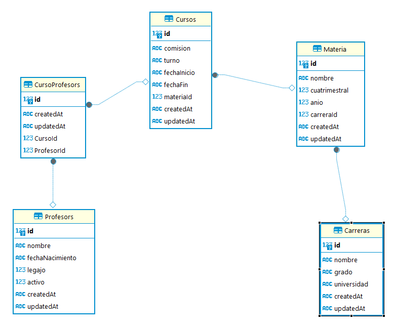

- LOS UNICOS COMANDOS QUE SE REQUIEREN PARA LA FUNCIONALIDAD DE ESTA API SON: "npm install" para la instalacion de las dependencias utilizadas y "npm run dev" para ejecutar la api y poder hacer las consulta de los endpoints atraves de su aplicacion de preferencia.